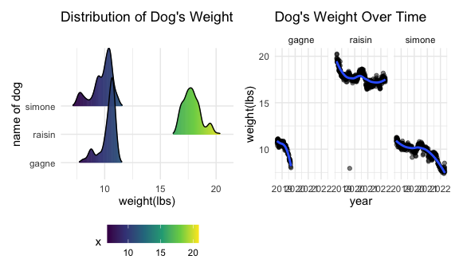

Midterm_Project
================

## Problem 1 - Data

The raw data includes observation date, weight of three dogs and the
standard object, notes describing their locations and special occasions
from 2018 to 2022. My goals of report is to separate text and weight
data into two separate csv, do data wrangling, visualization for the
weight data with information from the notes.

For the weight data part, when date is imported from excel, it shows as
numeric value of days starting from 1899-12-30. I used the as.Date
function to provide correct expression of date column. The weight of dog
is given by Lbs Oz. We need to convert it into single unit for
convenience of analyzing. Here I converted the variables into numeric
columns and converted them into lbs weight of each dog.

For the text part, date column is a sub-column under weight which can’t
be directly selected with the notes column. I imported the data and drop
the first row, then rename the first column - date. The resulting
notes_df has 361 observations of 2 variables.

``` r
weight_df =
  read_excel("./data/dogweights_07may2022.xlsx", range = ("B2:F363")) %>% 
  janitor::clean_names() %>%
  mutate(date = as.numeric(date)) %>% 
  mutate(date = as.Date(date, origin = "1899-12-30")) %>% 
  separate(raisin, into = c("r_lbs", "r_oz"), sep = 2) %>% 
  separate(simone, into = c("s_lbs", "s_oz"), sep = 2) %>% 
  separate(gagne, into = c("g_lbs", "g_oz"), sep = 2) %>% 
  separate(std, into = c("std_lbs", "std_oz"), sep = 2) %>%
  mutate_if(is.character,as.numeric) %>% 
  mutate(r_oz = r_oz/16, s_oz = s_oz/16, g_oz = g_oz/16, std_oz = std_oz/16) %>% 
  mutate(raisin = r_oz + r_lbs, simone = s_oz + s_lbs, gagne = g_oz + g_lbs, std = std_oz + std_lbs) %>% 
  select(date, raisin, simone, gagne, std)

notes_df =
  read_excel("./data/dogweights_07may2022.xlsx", range = ("B1:G363")) %>% 
  janitor::clean_names() %>% 
  select(weight_lbs_oz, notes) %>% 
  slice(-1) %>% 
  rename(date = weight_lbs_oz) %>% 
  mutate(date = as.numeric(date)) %>% 
  mutate(date = as.Date(date, origin = "1899-12-30"))
```

#### export to data folder

``` r
write.csv(weight_df,"./data/weight_df.csv", row.names = FALSE)
write.csv(notes_df,"./data/notes_df.csv", row.names = FALSE)
```

## Problem 2 - EDA

The resulting weight df has 361 observations of 5 variables. It contains
date, lbs weight of three dogs and the standard object during
observation. There are 361 unique dates of observations.

``` r
weight_df %>% 
  summarize(distinct_date = n_distinct(date))
```

Summarizing table for number of observations, average weight and the
standard deviation for each dog

``` r
weight_df %>% 
  pivot_longer(
    raisin:gagne, 
    names_to = "dog",
    values_to = "weight_lbs") %>% 
  group_by(dog) %>% 
  summarize(n_obs = n(), mean = mean(weight_lbs, na.rm = TRUE), sd = sd(weight_lbs, na.rm = TRUE)) %>% 
  knitr::kable(caption = "Statistics of dogs", digits = 4)
```

| dog    | n_obs |    mean |     sd |
|:-------|------:|--------:|-------:|
| gagne  |   361 | 10.2953 | 0.7055 |
| raisin |   361 | 17.7862 | 0.9337 |
| simone |   361 |  9.7906 | 0.9158 |

Statistics of dogs

## Problem 3 - Visualization

All three dogs have peak of weight during 2018 and have a trend of
decreasing weight from 2018 to 2022. Frequent moving might be a reason
of decreasing weight. Gagne died in 2019 and his data stopped there. The
reason of rapid drop of Gagne’s weight might be health problems before
death. Simone and Gagne’s weights are alike. Their most frequent weights
are around 11 lbs. Raisin’s most frequent weight is around 17.5 lbs. For
Simone, its weight dropped significantly after having neurological
problem in 2021. For Raisin, his most rapid drop of weight is during
2018 when dogs spent lots of time at Weber’s.

``` r
distribution_plot =
  weight_df %>%
  pivot_longer(
    raisin:gagne, 
    names_to = "dog",
    values_to = "weight_lbs") %>% 
  ggplot(aes(x = weight_lbs, y = factor(dog), fill = stat(x))) +
  ggridges::geom_density_ridges_gradient(scale = 3, rel_min_height = 0.01, alpha = 0.5) +
  labs(
    title = "Distribution of Dog's Weight",
    x = "weight(lbs)",
    y = "name of dog"
  ) 

time_plot =
  weight_df %>% 
  pivot_longer(
    raisin:gagne, 
    names_to = "dog",
    values_to = "weight_lbs") %>%
  ggplot(aes(x = date, y = weight_lbs)) +
  geom_point(alpha = .5) + 
  geom_smooth(se = FALSE) +
  facet_grid(~dog) +
  labs(
    title = "Dog's Weight Over Time",
    x = "year",
    y = "weight(lbs)"
  ) 

distribution_plot + time_plot
```



#### export to results folder

``` r
ggsave("twopanel_plot.png", path = "./results", width = 10)
```
